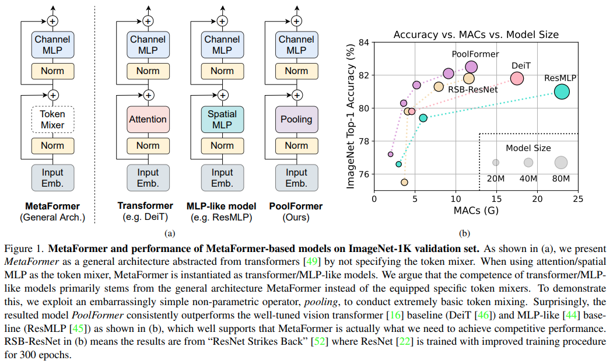

</img>

## Metaformer - GPT (wip)

Implementation of <a href="https://arxiv.org/abs/2111.11418">Metaformer</a>, but in an autoregressive manner. In particular, they propose simply using mean centering as a way to do token mixing in a parameter-less fashion, alternating with feedforwards.

## Install

```bash
$ pip install metaformer-gpt
```

## Usage

```python
import torch
from metaformer_gpt import MetaformerGPT

gpt = MetaformerGPT(
    num_tokens = 256,
    dim = 512,
    depth = 8
)

ids = torch.randint(0, 256, (1, 1024))
logits = gpt(ids) # (1, 1024, 256)
```

## Citations

```bibtex
@article{Yu2021MetaFormerIA,
    title   = {MetaFormer is Actually What You Need for Vision},
    author  = {Weihao Yu and Mi Luo and Pan Zhou and Chenyang Si and Yichen Zhou and Xinchao Wang and Jiashi Feng and Shuicheng Yan},
    journal = {ArXiv},
    year    = {2021},
    volume  = {abs/2111.11418}
}
```

```bibtex
@misc{woo2022etsformer,
    title   = {ETSformer: Exponential Smoothing Transformers for Time-series Forecasting},
    author  = {Gerald Woo and Chenghao Liu and Doyen Sahoo and Akshat Kumar and Steven Hoi},
    year    = {2022},
    eprint  = {2202.01381},
    archivePrefix = {arXiv},
    primaryClass = {cs.LG}
}
```
